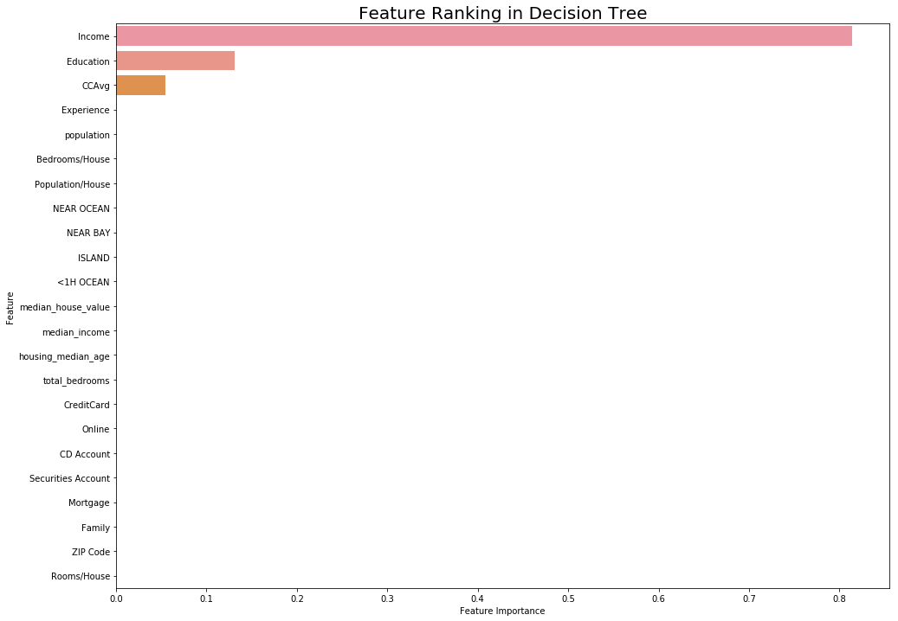
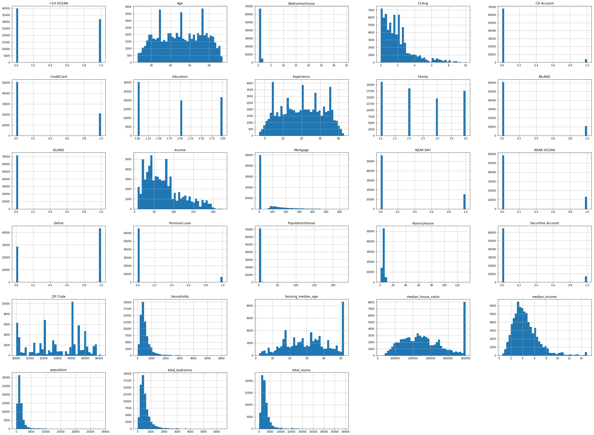

# Capstone Project   
## Customer Personal Loan Prediction 
## Table of Contents
1. [File Descriptions](#File-Descriptions)
2. [Executive Summary](#Executive-Summary)
3. [Business Understanding](#Business-Understanding)
4. [Data Understanding](#Data-Understanding)
5. [Project Objective](#Project-Objective)
6. [Data Sources](#Data-Sources)
7. [Methodological Process](#Methodological-Process)
8. [Modelling](#Modelling)
9. [Data Visualizations](#Data-Visualizations)
10. [Feature Importance](#Feature-Importance)
11. [Evaluation](#Evaluation)
12. [Future Improvement Ideas](#Future-Improvement-Ideas)

### File Descriptions
Data - This folder contains the datasets used for this project in CSV format.

Personal_Loan.ipynb - This is the notebook containing the in depth Data Preparation, Modelling and Evaluation of our best performing model. To reproduce the results of this notebook. Simply clone it into your drive and run all cells.

Personal_Loan.pdf - Presentation summarising findings and actionable problem solving solutions for the bank to deploy to improve efficiency and achieve requirements.

For reproducibility of this notebook simply clone to your local drive and run the notebook in Jupyter.

### Executive Summary

Decision Trees after performing Hyperparameter Optimisations turned out to give an accuracy level of 99.912%. This result caused further investigative measures to check for data leakage and overfitting and was accounted for during cross validation and fitting to a validation dataset.

Before undertaking this project I had often thought that level of Education would not be a strongly indicative predictor whether a person would be offered and subsequently accepting a loan. However, the findings seemed to prove otherwise when modelling feature importance.

### Business Understanding
As an employee of Universal Banking Corporation (UBC) we have noticed the growing population of our bank's users. Given recent measures and the economic climate, we are trying to produce and improve the way the bank seeks out and provides customer loans. We are producing a model that will predict the likelihood of a customer obtaining a loan from UBC, on the basis the customer is invited to apply for a loan. 

In a cost and time efficient way, such models like the one produced would be conducive to banks as it would be helpful to identify the customers likely to be accepted to loan applications. This improves the rate at which banks increase their revenue and reduces the necessity to look externally for other customers. Such models could also be used to encourage existing customers to apply for additional loans including credit cards, overdrafts, and mortgages.

### Data Understanding

This project investigates a Bank Loan Modelling dataset. The California Housing Dataset was used in addition to the Bank Loan Modelling dataset to obtain additional features and thereby see an impact on our prediction, if any. 

By using the longitude and latitude data from the California Housing Dataset, I was able to convert the coordinates into zipcodes and merge this with the Bank Loan Modelling Dataset.

### Project Objective

The objective of this project was to utilise several key features such as income, mortgage, and size of household and build multiple classification models and determine the likelihood of a customer obtaining a personal loan. 

Utilising such models would be fruitful for banks as they could identify and increase the conversion rate of customers successfully accepting personal loans for their own use.

## Data Sources
The datasets for this project was obtained from Kaggle and have been attached using a Hyperlink:

- Bank Loan Modelling - [https://www.kaggle.com/itsmesunil/bank-loan-modelling]()
- California Housing Data -  [https://www.kaggle.com/camnugent/california-housing-prices]()

## Methodological Process

A project of this magnitude required a great depth of thinking as to how I would overcome and approach a challenge. To do this I utilised the CRISP-DM model which included the following stages:

- Business Understanding
- Data Understanding
- Data Preparation
- Modelling
- Evaluation
- Deployment

## Modelling

The models investigated in this notebook were:

- Logistic Regression (Baseline Model)
- Random Forest Classifier
- Decision Trees Classifier 

All of these models were Hyperparameter Tuned using GridSearchCV to obtain a better score.

## Data Visualizations

Our bar chart displaying the initial relationship between the number of customers accepting the loan versus not accepting a loan was the result of initial data exploration. 

Subsequently the percentage of people accepting loans versus not accepting loans was calculated. This result was 8.93% of customers being offered and accepting a loan. In contrast, 91.07% of customers did not accept the loan on the basis they were offered one.

This heatmap was used to show the initial correlation of features within the DataFrame and also remove features that were causing multicollinearity. 

#### Feature Importance

Through data modelling, the most important features of the data set which determined the loan acceptance rate were the Education, Income, and Average Spending on Credit Cards per month (000s), denoted as CCAvg.

These are displayed in the following bar charts using Seaborn.

The Histogram plot of the variables gave us a real feel for our data, and allowed me to interpret the general skewness of our data This was produced using Seaborn.

#### Contact Details

If you liked this project, and would like to learn more, then contact me directly on the following:

* [arman_hussain786@hotmail.com]()
* [https://www.linkedin.com/in/arman-hussain-110793ah/]()

## Evaluation

The best performing model was Decision Trees. The ROC_AUC score produced on the validation training set was 95.46%. After Hyperparameter Tuning Optimisation this score was 99.912%

## Future Improvement Ideas

Given the opportunity to further improve this project and with less computationally intensive limitations, I would run more classification models including but not limited to Gaussian Naive Bayes and K-Nearest Neighbours algorithms.

The use neural networks to detect loan recovery rates following loan acceptance could be particularly conducive for banks. 

Lastly, applying our hyper parameters to other economical datasets of similar binary classification problems
