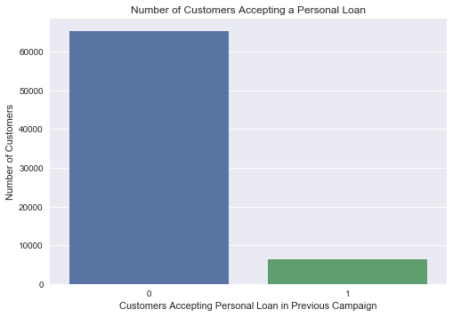
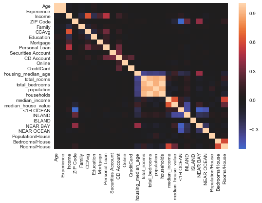
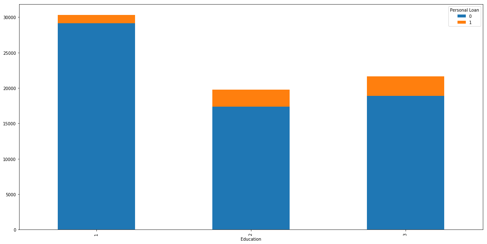
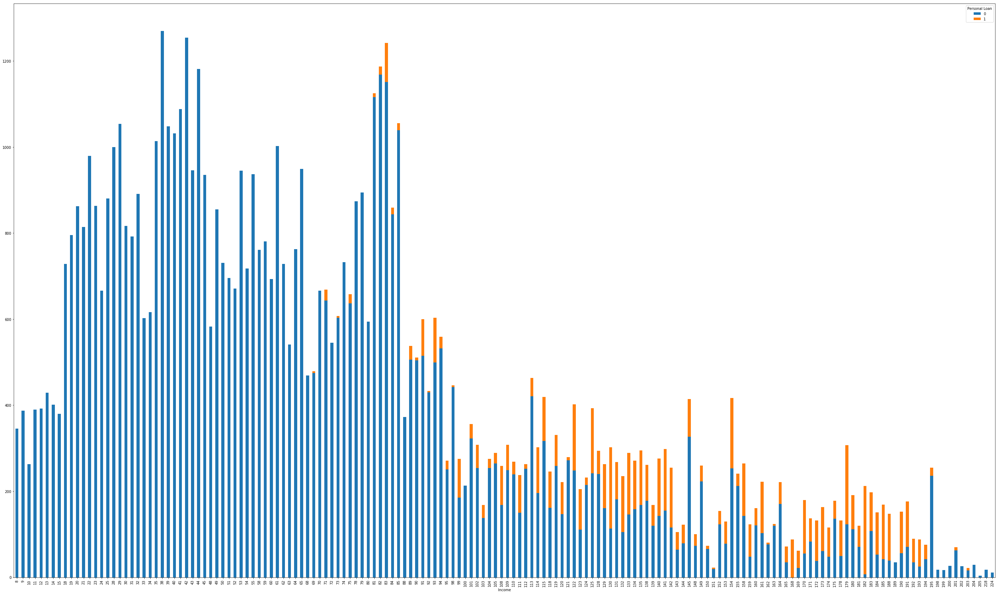
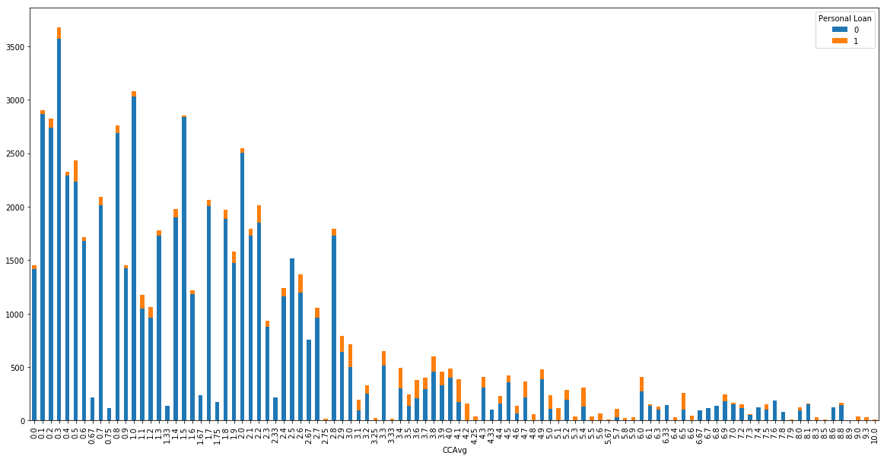

# Capstone Project   
## Customer Personal Loan Prediction 

The objective of this project was to utilise several key features such as income, mortgage, and size of household and operate multiple classification models and determine the likelihood of a customer obtaining a personal loan. 

Utilising such models would be fruitful for banks as they could identify and increase the conversion rate of customers successfully accepting personal loans for their own use.

If you liked this project, and would like to learn more, then contact me directly on the following:

* [arman_hussain786@hotmail.com]()
* [https://www.linkedin.com/in/arman-hussain-110793ah/]()

### Executive Summary

Start with one or two sentences here that contextualises what your project matters here.
These two sentences will demonstrate your business understanding. 

Next, in a second paragraph, write how you were able to make a data science operationalization of the problem.
For example, you might say that in order to help solve this problem you set out to build a classification ML model in order to automate some process. 

Third, you then write what you did on the project that is a bit more technical.
Here you might say that you took data from [here and make it a link to the original data]() and then ran `a list of models you ran here` in your analysis.
Then end with one sentence that picks what your best model was and how it performed.

Lastly, you say in one or two sentences why this matters. 
For example, now as opposed to before this data analysis, you can now predict X better than Y. 

###Project Goal

The goal of this project was to create classification model that was able to predict the likelihood of a customer obtaining a personal loan from Universal Banking Corporation. 

> If you are able to swap out the text here with what your case example is you will demonstrate the following:
> 1. You get why what you're doing 'matters'
> 2. You are able to take ill defined problems and turn them into something a data scienst can solve
> 3. You show off your analystical and modeling chops.
> 4. You are able to communicate technical things you do.

### More Information

Below your Executive Summary, you can document whatever you feel would be of interest to a future employer.
Here I would especially suggest diving a bit deeper into your methodology and including images that you are proud of from the project. 
Remember, that people will probably judge your github project page within 45 seconds tops, you want it to look as clean as possible. 

Write documentation that looks like someone you would want to work with.

### Data Visualizations

Our bar chart displaying the initial relationship between the number of customers accepting the loan versus not accepting a loan was the result of initial data exploration. 

Subsequently the percentage of people accepting loans versus not accepting loans was calculated. This result was 8.93% of customers being offered and accepting a loan. In contrast, 91.07% of customers did not accept the loan on the basis they were offered one.

This heatmap was used to show the initial correlation of features within the DataFrame and also remove features that were causing multicollinearity. 

#### Feature Importance

Through data modelling the most important features of the data set which determined the loan acceptance rate were the Education, Income, and Average Spending on Credit Cards per month (000s), denoted as CCAvg.

These are displayed in the following bar charts using Seaborn

